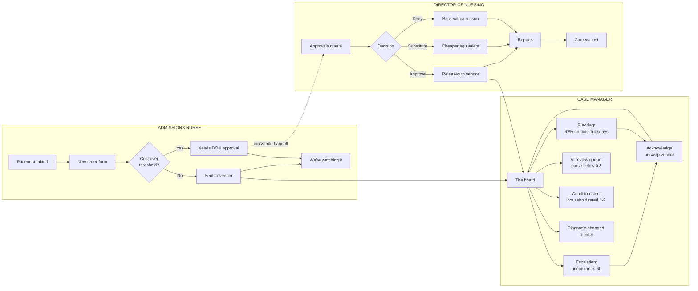
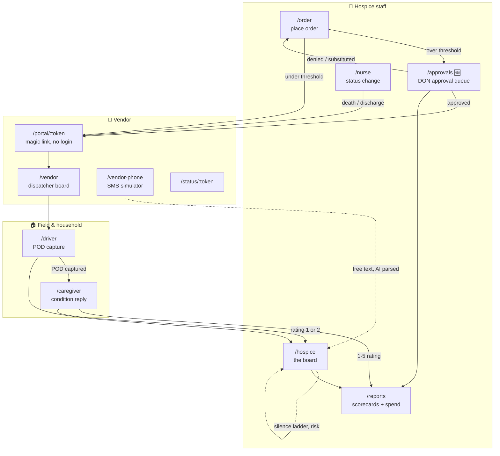
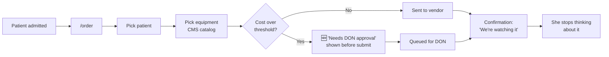
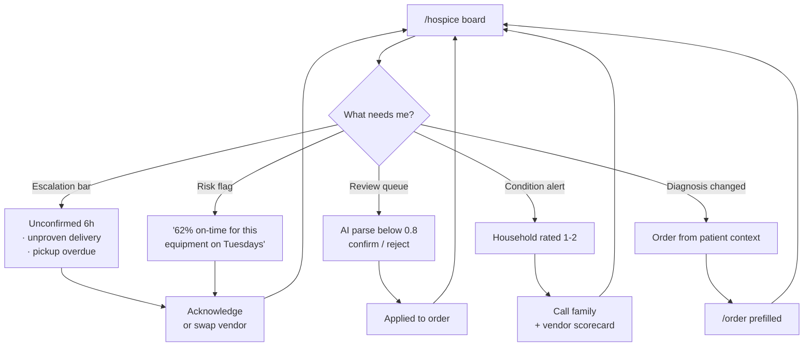
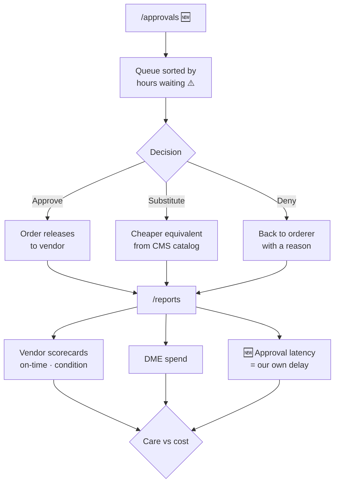

# Page map, user flows, and the three hospice roles

**What this is:** every screen that exists, every screen we think should exist, how each of the
three hospice users moves through them, and what each one is allowed to see.

**Why it exists:** we built surfaces fast and in parallel. The nav is flat — all seven links are
visible to everyone — and the three personas are currently a *coral text label* at the top of a
page. Nobody has drawn the actual flow. A judge asking "so who logs in and what do they see?" is
asking the 15% UX row and part of the 25% core-user-problems row at the same time.

Read with [FEATURES.md](FEATURES.md) (what's built) and
[deliverables/DIFFERENTIATION.md](deliverables/DIFFERENTIATION.md) (why it matters).

**Viewing the diagrams:** they're mermaid, which GitHub renders natively — just open this file in
the repo on github.com. In VS Code you need the *Markdown Preview Mermaid Support* extension, then
`Cmd+Shift+V`. Deliberately not in Figma: the diagrams belong next to the code so they go stale
loudly rather than quietly.

---

## 1 · The page count

**11 routes, 10 page components** (`VendorPortal` serves both `/vendor-portal` and `/portal/:token`).

### Who each screen actually serves

| Audience | Count | Routes |
|---|---:|---|
| **Hospice staff** — our three users | **4** | `/hospice` · `/order` · `/nurse` · `/reports` |
| Vendor side | 5 | `/vendor` · `/vendor-portal` · `/portal/:token` · `/status/:token` · `/vendor-phone` |
| Field & household | 2 | `/driver` · `/caregiver` |

### The finding

Of 11 screens, **4 serve the hospice — and all three roles see all four, identically.** There is no
role concept anywhere:

- `grep -rn "role\|approv" server/ shared/` → **one hit**, and it's `role: 'user'` in the Claude
  API call. Nothing else.
- `PersonaHeader.tsx` renders `persona` as a coral uppercase string. It is a caption.
- `AccountControl` in `App.tsx:38` is hardcoded `"Case Manager"` behind a local `useState`.
- `shared/types.ts:26` — `Actor = 'hospice' | 'vendor' | 'driver' | 'system' | 'ai' | 'family'`.
  **`hospice` is one undivided actor.** The append-only ledger — the thing our whole
  accountability story rests on — cannot record *which* hospice user did something.

That last one matters most. We tell judges the ledger records "who said it and through which
channel." For vendors that's true. For our own staff it currently is not.

---

## 2 · The three roles

Named from the sponsor briefing. The repo's older names are noted where they drift.

### Admissions nurse *(repo: "ordering nurse")*

**The job:** patient is admitted to hospice; the bed, the oxygen concentrator, the wheelchair have
to be in the house before the patient gets home. Places most of the order volume.

**Where she is:** in the field, on a phone, often in the patient's home or the discharging hospital.

**Wants:** place an order in under a minute and stop thinking about it. She does *not* want a
board, a risk score, or a vendor scorecard — she wants a promise that someone else is watching.

**Should not have:** vendor swap, escalation acknowledge, reports, approvals.

### Case manager *(repo: "case worker")*

**The job:** owns the patient's whole episode. Orders too — but on a *different trigger*: the
diagnosis changes, the patient declines, and now they need a hospital bed where a walker was fine
last week. Then owns everything after the order: chasing, escalations, swaps.

**Where she is:** at a desk, the board open all day. This is the primary daily driver of the product.

**Wants:** one screen that shows only what's off-track, with the reason in a sentence.

**The ordering difference that matters for design:** the admissions nurse starts from a *blank
form*; the case manager starts from a *patient*. Same order, two entry points. Today `/order` only
supports the blank form.

### Director of nursing *(repo: "directing nurse")*

**The job:** approves orders above a cost threshold, reads reports, and is accountable for the
balance between care quality and spend. The only role with a budget in their head.

**Where they are:** in reports weekly, in the approval queue daily.

**Wants:** to approve fast without becoming the bottleneck, and to see whether cost decisions are
hurting care.

**Has that nobody else does:** approval authority, spend visibility, vendor scorecards.

**Note the tension in the role, because it's the interesting part:** the DON is asked to hold down
cost *and* not delay care. Those pull opposite directions, and the approval step is where they
collide. See §5.

---

## 3 · Access matrix

✅ full · 👁 read-only · ⛔ hidden · 🆕 doesn't exist yet

| Screen | Admissions nurse | Case manager | Director of nursing |
|---|:--:|:--:|:--:|
| `/order` — place an order | ✅ | ✅ *(from patient)* | 👁 |
| `/hospice` — the board | 👁 *own patients* | ✅ | 👁 *all* |
| `/nurse` — status change / pickup trigger | ✅ | ✅ | ⛔ |
| `/approvals` — approve high-cost 🆕 | ⛔ | 👁 | ✅ |
| `/reports` — scorecards & spend | ⛔ | 👁 *on-time only* | ✅ |
| Vendor swap | ⛔ | ✅ | ✅ |
| Acknowledge escalation | ⛔ | ✅ | ✅ |
| AI review queue | ⛔ | ✅ | ⛔ |
| Condition ratings | ⛔ | 👁 *own patients* | ✅ *aggregate* |

**The design rule behind the matrix:** *seniority widens what you can see, and narrows what you
have to do.* The admissions nurse sees one patient and acts constantly. The DON sees everything and
acts rarely. The case manager is the only role that both sees broadly and acts constantly — which
is exactly why she's the one drowning today, and why she gets the escalation machinery.

---

## 4 · The flows

Two lenses on the same product. The first is organised **by role** — what each person does, start to
finish. The second is organised **by screen** — what exists and who touches it. The per-role
detail follows.

### All three roles in one picture



**The one dashed line is the whole point.** It is the only place the three roles hand work to each
other, and it is the only one of these paths that doesn't exist in the product today.

### System map — every screen, colored by who touches it



### Admissions nurse — the one-minute flow



The 🆕 node is the important one: she learns her order needs approval **at the moment she places
it**, not an hour later when nothing has moved. Silence is the enemy in this product — including
our own silence.

### Case manager — the exception-handling loop



### Director of nursing — approve, then look up



---

## 5 · The approval gate, and why it's more than a form

Adding DON approval means a new state before `ordered`:

```
[pending_approval] → ordered → dispatched → in_transit → delivered → pickup_pending → …
```

Straightforward. But it has a consequence worth putting on a slide:

**An approval step is the first delay in this system that is the hospice's own fault.**

Everything we've built measures the vendor — silence ladder, on-time rate, unproven claims,
condition. If a DON sits on an approval for six hours, the bed is six hours late and **not one of
our existing metrics would show it.** Worse, if the SLA clock starts at *approval* rather than at
*order*, the vendor absorbs a delay they didn't cause, and our scorecards — the thing we're asking a
hospice to pick vendors with — get quietly wrong.

So:

1. **The clock starts at order placement**, and the ledger records approval latency as its own
   span, attributed to the hospice.
2. **`/reports` gets an approval-latency stat next to the vendor scorecards.** The DON's own
   screen shows the DON's own drag.
3. `Actor` splits so the ledger can name which hospice user did what (§7).

That last bit is the honest version of "balance between care and cost." A system that only ever
measures the vendor is a system that flatters whoever bought it. Ours shouldn't.

**Threshold:** config (`APPROVAL_THRESHOLD_USD`), applied against the CMS allowed amount already in
`shared/catalog.ts`. **Any specific dollar figure is an assumption we have not validated** — real
thresholds vary by hospice and we'd confirm with the sponsor. Per FAQ §6, we say that rather than
invent a number that sounds researched.

### Proposed `/approvals` wireframe

```
┌──────────────────────────────────────────────────────────────────┐
│ DIRECTOR OF NURSING                                              │
│ Approvals                                    3 waiting · 1 urgent│
├──────────────────────────────────────────────────────────────────┤
│ ⚠ WAITING 4h 20m                                                 │
│ Hospital bed, semi-electric  ·  E0261      CMS allowed $1,067    │
│ M. Alvarez · admitted today · discharge home 4pm                 │
│ Requested by Admissions nurse · Urgent                           │
│ ┌────────────────────────────────────────────────────────────┐   │
│ │ Cheaper equivalent: manual bed E0250 · $612 · saves $455    │   │
│ │ ⓘ Patient cannot self-reposition — clinical note attached  │   │
│ └────────────────────────────────────────────────────────────┘   │
│         [ Approve ]   [ Substitute ]   [ Deny with reason ]      │
├──────────────────────────────────────────────────────────────────┤
│   WAITING 40m                                                    │
│ Oxygen concentrator · E1390 · $189/mo rental                     │
│ …                                                                │
└──────────────────────────────────────────────────────────────────┘
```

The substitution card is the care-versus-cost decision made *visible in one place* — the cheaper
option and the clinical reason not to take it, side by side. That's the DON's actual job rendered as
a UI, and it's a better answer to "addresses core user problems" than another chart.

---

## 6 · Nav, per role

Today: seven links, flat, same for everyone.

```
Board · New order · Nurse · Vendor phone · Driver · Portal · Reports
```

Proposed:

| Role | Nav |
|---|---|
| Admissions nurse | **New order** · My patients |
| Case manager | **Board** · New order · Nurse · Reports |
| Director of nursing | **Approvals** · Board · Reports |

**Demo-safety recommendation:** make the `AccountControl` dropdown a **live role switcher** rather
than hard-filtering routes. Presenter switches role on stage and the nav visibly changes — which
*demonstrates* the role model instead of describing it — and no screen becomes unreachable if we
switch mid-demo. Vendor/driver/caregiver props stay reachable by direct URL as they are now.

This is the cheapest high-visibility UX win available: one dropdown, one context, one filtered
array.

---

## 7 · Build plan

Ordered by payoff per hour. Nothing here is started.

| # | Item | Size | Why |
|---:|---|:--:|---|
| 1 | Role switcher in `AccountControl` + filtered `surfaceLinks` | **S** | Turns three captions into a visible role model. Highest ratio on this list |
| 2 | Split `Actor: 'hospice'` → `admissions_nurse` \| `case_manager` \| `don` | **S** | The ledger can finally name our own people. Touches types + seed |
| 3 | `pending_approval` state + `/approvals` screen | **M** | The DON's missing job. Needs state machine + guard + tests |
| 4 | Cost shown at order time + threshold warning | **S** | Data already exists in `shared/catalog.ts`; `/order` just never shows it |
| 5 | Approval latency on `/reports` | **S** | The honesty beat in §5. Cheap once 3 exists |
| 6 | Order-from-patient entry for the case manager | **S** | Prefilled `/order`; the diagnosis-change trigger |
| 7 | Per-role board filtering (own patients vs all) | **M** | Needs a patient→staff assignment that doesn't exist in the seed |

**If only one thing gets built: #1 and #2 together.** They're both small, they make the three-persona
claim true rather than decorative, and #2 is the one that closes a real hole in the accountability
story we're already telling on stage.

**If the day runs short:** #3 is the one to *draw* rather than build. This document plus the
wireframe in §5 is a legitimate Deliverable-D style answer, and FAQ §9 explicitly rewards
forward-compatible design that's honestly labelled as designed-not-built.

---

## 8 · Open questions

1. **Who taps "patient died"?** `/nurse` fires the pickup trigger, but none of the three named roles
   is obviously the person standing in the house at 2am. Is that a fourth role (visiting/on-call
   nurse), or does the case manager do it from a phone call? **This affects whether `/nurse` is a
   role surface or a shared utility** — the flows in §4 assume shared.
2. **Can the case manager approve?** Some hospices let the case manager approve under a second,
   lower threshold. Currently modelled as DON-only.
3. **What is the threshold?** See §5 — unvalidated.
4. **Does the admissions nurse ever see the board?** Matrix says read-only for her own patients,
   but that requires a patient→staff assignment the seed doesn't have (build item #7).
5. **`/vendor` vs `/vendor-phone`** — pre-existing naming collision, see FEATURES.md §8.1. Still
   unresolved and the demo driver needs to know which one to open.
