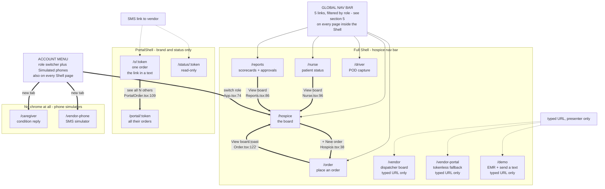
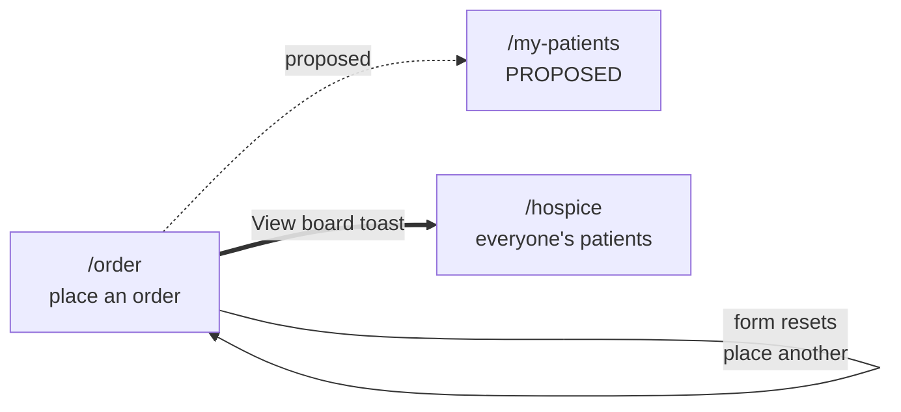
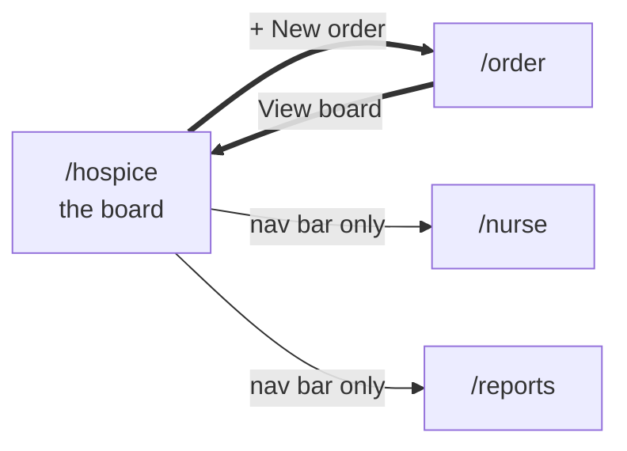
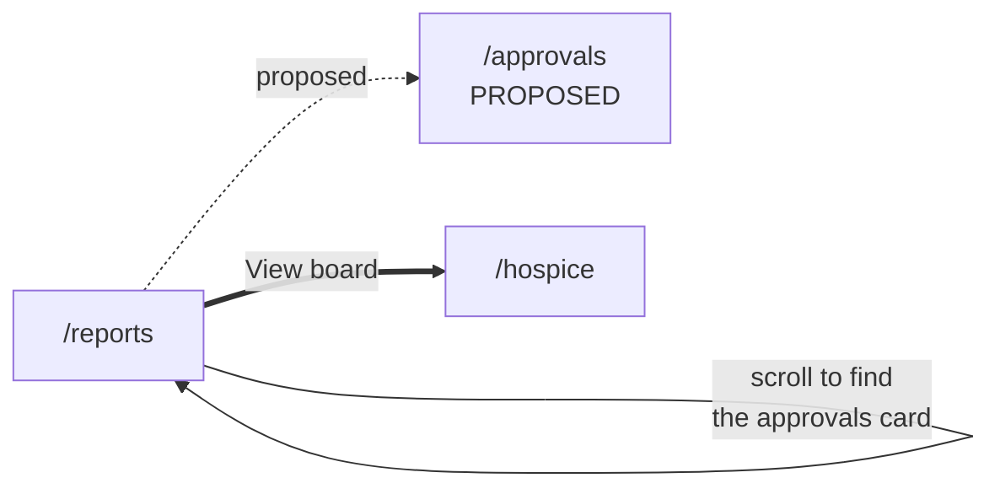
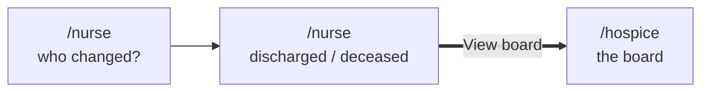
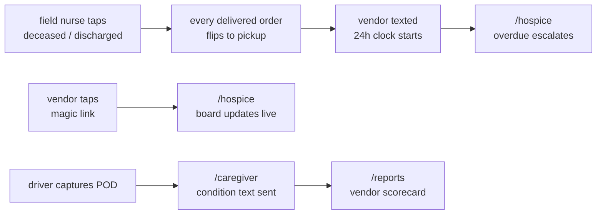

# Page map and navigation flow

**What this is:** every page in the app as a labelled box, with arrows showing where each user can
actually go from where.

**How this was verified — read this before trusting the arrows.** Every arrow below is a real
navigation affordance found in the code, not an inferred user journey. The search that produced it:

```bash
grep -rnE "useNavigate|navigate\(|window\.location|<Link|<NavLink|href=" client/src/pages/ client/src/components/
```

That returns **eight** navigation affordances in the entire application: four `navigate()` calls
(`Order.tsx:122`, `Nurse.tsx:96`, `Reports.tsx:86`, and `App.tsx:74` — the role switch), two
`<Link>`s (`Hospice.tsx:38` "+ New order", `PortalOrder.tsx:109` "see all"), and two new-tab
anchors in the account menu. No full page loads anywhere. Everything else is the global nav bar. An
earlier draft of this document drew vendor and driver arrows that were really *system events*, not
navigation — those now live in §4, clearly separated.

**Last re-derived 2026-08-14, after the Board v8 rebuild.** That rebuild moved the EMR simulator to
`/demo` and deleted the board's inline order form; the same day added `/o/:token`, the role-switch
landing, and the account-menu phone links. Every count below was recounted against the code, not
edited in place.

**Viewing:** mermaid renders on github.com natively; in VS Code use *Markdown Preview Mermaid
Support* + `Cmd+Shift+V`. All diagrams here were rendered through `mermaid-cli` v9 and v10 before
committing, not eyeballed.

Read with [FEATURES.md](FEATURES.md) and
[deliverables/DIFFERENTIATION.md](deliverables/DIFFERENTIATION.md).

---

## 1 · Every page, one line each

**13 routes, 12 page components** (`VendorPortal` serves both `/vendor-portal` and `/portal/:token`),
plus `/` which redirects to `/hospice`.

### Hospice staff — 4 pages

| Route | Persona in code | What the page is |
|---|---|---|
| `/order` | Admissions Nurse | Blank order form: patient, equipment, qty, needed-by, urgency, vendor |
| `/hospice` | Case Manager | The board. Three sections (Needs you / On the way / Done), five-slot rows, tap-open detail with risk reasons + evidence, swap-vendor dialog, review-queue card when non-empty. Order form lives at `/order`; EMR simulator moved to `/demo` |
| `/nurse` | Field Nurse | Two taps: pick patient, then discharged/deceased. Fires the pickup trigger |
| `/reports` | Director of Nursing | Vendor scorecards, condition stats, calls avoided, pickup latency, DME spend, **and the cost-approval queue** |

### Vendor side — 6 pages

| Route | What the page is |
|---|---|
| `/o/:token` | **The link in every text.** Per-order, 10-char token. Opens that one order with its actions, plus "you have N other open orders" |
| `/portal/:token` | Per-vendor magic link, no login. All their open orders, grouped, with an equipment tab |
| `/vendor-portal` | Same component, no token. **Off the nav** — tokenless it can only render its "open the link we texted you" empty state, so it's a typed-URL fallback, not a surface |
| `/status/:token` | Read-only vendor status view |
| `/vendor` | Dispatcher board + in-page phone simulator. **Off the nav** — typed URL only |
| `/vendor-phone` | Full-screen SMS simulator. No buttons — a typed digit routes deterministically, prose gets the model. Account menu → Simulated phones, new tab |

### Presenter tools — 1 page

| Route | What the page is |
|---|---|
| `/demo` | EMR feed (mark a patient discharged / deceased) and send-a-text-by-hand. Took the EMR simulator off the board in the v8 rebuild. Not in the nav, and not in the account menu either — typed URL only |

### Field & household — 2 pages

| Route | What the page is |
|---|---|
| `/driver` | Phone-sized. Today's stops, POD capture: photo, signature, condition checklist |
| `/caregiver` | Family's phone. Condition check arrives, reply 1-5. Account menu → Simulated phones, new tab |

### Proposed — 2 more

| Route | What it would be | Why |
|---|---|---|
| `/approvals` | The DON's queue, sorted by how long each order has waited | Today it's a card buried on a weekly-reading page |
| `/my-patients` | Admissions nurse's "did my stuff arrive" list | She can place an order and then has nowhere to look |

---

## 2 · The navigation map

`App.tsx` splits the app into **three** chrome levels. The full Shell carries the hospice nav bar.
`PortalShell` carries the betterRX mark and the live indicator and nothing else — it wraps the
three token routes a vendor can arrive on from a text (`/o/:token`, `/portal/:token`,
`/status/:token`). `/caregiver` and `/vendor-phone` get no chrome at all, because they stand in for
real handsets.

The two handsets are **off the surface nav but not unreachable**: the account dropdown carries a
"Simulated phones" section under the role list that opens each one in a new tab. They aren't roles
— neither the vendor nor the family has an account here — but the account control is the one
element on every Shell page, and the demo needs the board and a handset open side by side.



Thick arrows are real in-app jumps. Thin arrows are the nav bar. Dashed arrows are external
entry — a link texted to a vendor, or a URL the presenter types.

Two of those thick arrows are new since the last pass. **The role switch navigates**: choosing a
role in the account menu now lands you on that role's first nav surface, because filtering the nav
while leaving you on a page the new role can't see was worse than not filtering. It goes to
`/hospice` for four of the six roles and `/driver` for Dispatcher and Driver. **And the
texted link is per-order**: `/o/:token` opens the one order the text was about, with a link onward
to the vendor's full portal if they have other work open.

**Where this stands after the XS fix batch:**

1. ~~`/nurse` and `/reports` have no exit at all.~~ **Fixed.** Both now carry a "View board" action
   in their header, so every hospice page has a designed way out and the board is the consistent
   home. The field nurse can finally see what her two taps set in motion.
2. ~~`/hospice` uses `window.location.href`, a full page reload that drops SSE.~~ **Fixed.** Every
   in-app jump is now `navigate()` or `<Link>`. Nothing tears down the event stream mid-demo, and
   the two account-menu phone links open a *new* tab rather than replacing the one you present from.
3. ~~`/portal/:token` renders inside the Shell, showing an external vendor the hospice's nav.~~
   **Fixed.** Both token routes moved out to `PortalShell`. Role filtering could never have fixed
   this — a vendor arrives with no session, and signed out deliberately shows every link. The route
   had to move. `/vendor-portal` (no token) stays in the full Shell, but it is **no longer in the
   nav**: with no token the component can only render "open the link we texted you", so as a nav
   destination it was a dead end by construction. It survives as a typed-URL fallback.
4. ~~The Dispatcher's two nav links both led somewhere a judge shouldn't be sent.~~ **Retired.**
   `/vendor-portal` (the dead end above) and `/vendor` (the one surface still on the pre-token
   slate/blue palette) are both off the nav. Dispatcher now navigates to **Driver** — the other
   vendor-side surface in the Shell — and reaches its own SMS thread through the account menu's
   Simulated phones. Both retired routes stay reachable by URL for a presenter.

---

## 3 · Where each user can actually go

Roles exist and the nav filters by them — see §5 for the link-by-role table. What roles do *not* do
is guard routes, so "can go" is still "can reach by URL" for everyone. These diagrams show where
each role *needs* to go, with the gap called out.

### Admissions nurse



**One page, and its only real exit lands her on the wrong screen.** The "View board" toast sends her
to the case manager's board showing every patient in the hospice, not hers. `/my-patients` is the
missing box.

### Case manager



**The only well-connected role**, and the round trip is now genuinely round: the board's "+ New
order" goes to `/order`, and placing one offers "View board" straight back.

**The inline order form on the board is gone** — the v8 rebuild deleted it, so `/order` is the only
place an order is written. That closes the duplicate-form question in §8 by removing the duplicate
rather than by sharing a component, and it costs her a step she used to save: the common case now
leaves the page. Worth watching in rehearsal; if it drags, the fix is a dialog on the board, not a
second form.

### Director of nursing



**One page doing two jobs.** Approving orders is daily; reading scorecards is weekly. They share a
screen and the daily task is the one you scroll to find. She now has a way back to the board.

### Field nurse



**Two taps, and now a way to see what happened.** The screen fires the pickup trigger; the
consequences land on the board. Until the XS batch she had no route there, so the most important
thing she does in this app was also the thing she got no feedback on.

---

## 4 · System events — NOT navigation

These are the arrows I previously drew on the navigation map by mistake. Nobody clicks these; they
are events propagating through the backend and out over SSE. Keeping them separate is the point.



---

## 5 · Roles: identity shipped, authorization did not

**This changed under us mid-build.** Commit `16e242e feat(client): mock role-based login in the
shell` landed while this document was being written, so an earlier version of it — pushed as
`098edfa` — claimed there was no role state anywhere. That claim is now wrong.

**What exists** (`client/src/lib/auth.tsx`): a `ROLES` array of **six** roles — Case Manager,
Admissions Nurse, Field Nurse, Dispatcher, Driver, Director of Nursing — plus `AuthProvider`,
`useAuth()`, sign in, sign out, switch role, persisted to `localStorage`.

**What it does:** changes the avatar initials and the name in the top-right corner.

```bash
grep -rn "useAuth" client/src --include="*.tsx" --include="*.ts" | grep -v "lib/auth"
# client/src/App.tsx:47   <- the dropdown itself, and nothing else
```

**The nav now filters by role** (added in the XS batch). Each entry in `surfaceLinks` carries a
`roles: RoleId[]`, and `Shell()` filters against the signed-in role:

| Role | Sees in the nav | Lands on when you switch to it |
|---|---|---|
| Case Manager | Board · New order · Nurse · Reports | `/hospice` |
| Admissions Nurse | Board · New order | `/hospice` |
| Field Nurse | Board · Nurse | `/hospice` |
| Director of Nursing | Board · Reports | `/hospice` |
| Dispatcher | Driver | `/driver` |
| Driver | Driver | `/driver` |
| *signed out* | *everything* | *stays put* |

**Switching role navigates** (`App.tsx:74`): you land on the first nav link that role can see, so
you're never left staring at a page your new role can't reach from its own nav. Picking the role
you're already in is a no-op. This makes the account menu the fastest way to move around the app
during a demo — switch to Driver and you're on `/driver`, no second click.

Field Nurse gets Board for a specific reason: `/nurse` now has a "View board" button, and **a nav
that hides a page the page itself sends you to is worse than no filtering at all.** Any future link
added to a page has to be checked against this table.

Dispatcher gets **Driver** for a different reason: its own two links were retired (§2.3 item 4), and
a role with an empty nav bar is worse than a role pointed somewhere honest. Driver is the other
vendor-side surface inside the Shell — same organisation as the dispatcher, and the one that shows
what happened to the load. The Board was the wrong answer: it would put a hospice's entire patient
list in a vendor employee's nav, which is the boundary the rest of this design is built on.

**Routes are deliberately not guarded.** Filtering hides links; it does not block URLs. Every screen
stays reachable by typing the path, so a mis-click during the demo can't strand the presenter — and
switching role visibly rearranges the nav, which demonstrates the role model rather than describing
it.

**Signed out shows every link on purpose**, so nobody loses a screen before choosing a role. The one
case where that would have leaked — a vendor on a magic link, who has no session at all — is handled
by chrome rather than by roles: those routes render in `PortalShell` and never had a nav bar to
leak. See §2.3.

**The deeper gap is unchanged:** `shared/types.ts:26` has
`Actor = 'hospice' | 'vendor' | 'driver' | 'system' | 'ai' | 'family'`. **`hospice` is one undivided
value.** Six roles now exist in the client and the ledger still cannot record which of them acted.
We tell judges the append-only ledger captures who acted and through which channel. For vendors
that's true; for hospice staff it isn't.

---

## 6 · The approval gate — what's real, what isn't

**Cost approvals already exist**, correcting another earlier error of mine: `mocks.ts` defines
`COST_APPROVAL_THRESHOLD_USD = 150` and `mockApprovals()`, and `Reports.tsx:437` renders
`CostApprovals` with working Approve/Deny buttons. My first grep covered only `server/` and
`shared/` for `*.ts` and missed the client `.tsx` entirely.

**But it is a mock, and the seam matters.** `decide()` (`Reports.tsx:450`) calls `setDecisions` —
local React state. No API call, no persistence, no ledger event, and **nothing gates dispatch**. An
order over $150/mo goes to the vendor whether or not the DON ever looks. The UI is real; the control
is not. **Don't demo the approve button as though it gates anything.**

Making it real means a `pending_approval` state ahead of `ordered`:

```
[pending_approval] -> ordered -> dispatched -> in_transit -> delivered -> pickup_pending
```

And that has a consequence worth a slide:

**An approval step is the first delay in this system that is the hospice's own fault.** Everything
we've built measures the vendor — silence ladder, on-time rate, unproven claims, condition. If a DON
sits on an approval for six hours, the bed is six hours late and **not one of our metrics would show
it.** Worse, if the SLA clock starts at *approval*, the vendor absorbs a delay they didn't cause and
the scorecards we ask a hospice to choose vendors with go quietly wrong.

So: **the clock starts at order placement**, approval latency is its own span attributed to the
hospice, and it shows on `/reports` beside the vendor scorecards. The DON's own screen shows the
DON's own drag. That's the honest version of "balance between care and cost" — a system that only
measures the vendor flatters whoever bought it.

**On the number:** `$150/mo` is real in the code but **not validated against any hospice**. Per
FAQ §6 we say that rather than let it read as researched.

---

## 7 · Build plan

| # | Item | Size | Status |
|---:|---|:--:|---|
| 1 | Filter `surfaceLinks` by `role` | XS | ✅ **done** — `roles: RoleId[]` per link, filtered in `Shell()` |
| 2 | Give `/nurse` and `/reports` an exit | XS | ✅ **done** — "View board" in both headers |
| 3 | Replace `window.location.href` with `navigate()` | XS | ✅ **done** — no full page reloads left |
| 4 | Move `/portal/:token` out of the Shell | XS | ✅ **done** — new `PortalShell`, brand + status only |
| 5 | Split `Actor: 'hospice'` into the six roles in `auth.tsx` | **S** | The ledger still can't name our own people. Client already has the enum |
| 6 | Show cost + threshold warning on `/order` | **S** | CMS amounts are in `shared/catalog.ts`; the form never reads them |
| 7 | `/approvals` page — move `CostApprovals` off `/reports` | **S** | Component exists. Mostly a move plus queue sorting |
| 8 | Persist approvals: server state + `pending_approval` + dispatch gate | **M** | Turns the mock into the feature |
| 9 | Approval latency on `/reports` | **S** | The honesty beat in §6 |
| 10 | `/my-patients` | **M** | Needs a patient-to-staff assignment the seed doesn't have |

**Every XS item (1–4) is done.** The highest-value remaining item is **5** — six roles now exist in
the client, the nav filters on them, and the ledger still records every one of them as an undivided
`hospice`. That gap is now the most visible inconsistency in the product: the UI knows who you are
and the audit trail doesn't.

**Shipped since this plan was written, and never on it.** Worth listing so the plan isn't read as
the whole record of what changed:

| Item | Where |
|---|---|
| Board v8 — three sections, five-slot rows, tap-open detail, swap dialog, review-queue dialog | `pages/Hospice.tsx`, `components/board/*`, `lib/board.ts` |
| EMR simulator and send-a-text moved off the board to `/demo` | `pages/Demo.tsx` |
| Account menu opens both phone simulators in a new tab | `App.tsx` `phoneLinks` |
| Switching role lands on that role's first surface | `App.tsx:74` |
| `/vendor` renamed "Dispatcher board" in its page header — and later retired from the nav | `App.tsx`, `pages/Vendor.tsx` |
| `/vendor` and `/vendor-portal` off the nav; Dispatcher's nav anchor is Driver | `App.tsx` `surfaceLinks` |
| Reply buttons removed; a typed digit routes like a structured one | `pages/*Phone.tsx`, `server/sms.ts` |
| Per-order magic links, shorter, with human dates in the copy | `server/portal.ts`, `server/messaging.ts`, `pages/PortalOrder.tsx` |

---

## 8 · Open questions

1. **Six roles in `auth.tsx` but three in the pitch.** Dispatcher, Driver and Field Nurse are in the
   switcher. Do we present six personas or three plus supporting cast?
2. **Can the case manager approve** under a lower second threshold? Currently modelled DON-only.
3. **Is $150/mo right?** Real in code, unvalidated against any hospice.
4. ~~**Two order forms** — `/order` and the inline card on `/hospice`.~~ **Resolved by deletion.**
   The v8 rebuild dropped the board's inline form; `/order` is the only one. See §3.
6. **`/demo` is reachable only by typing the URL.** The two phone simulators got an account-menu
   entry; the presenter's own EMR and send-a-text page didn't. Either add it beside them or accept
   that whoever drives the demo has to remember the path.
7. **The order form still shows no cost** (build plan item 6), so the DON's $150 threshold has no
   counterpart at the moment of ordering. `avg_allowed_usd` is right there in `shared/catalog.ts`.
5. ~~**`/vendor` vs `/vendor-phone`**~~ — **resolved twice over.** `/vendor` is "Dispatcher board"
   in its own page header, and it has since left the nav entirely; "Vendor phone" now unambiguously
   means `/vendor-phone`, which the account menu opens as "DME vendor's phone". FEATURES.md §8.2.
