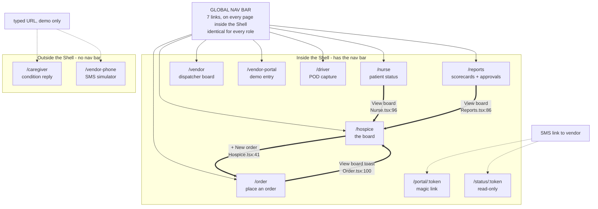
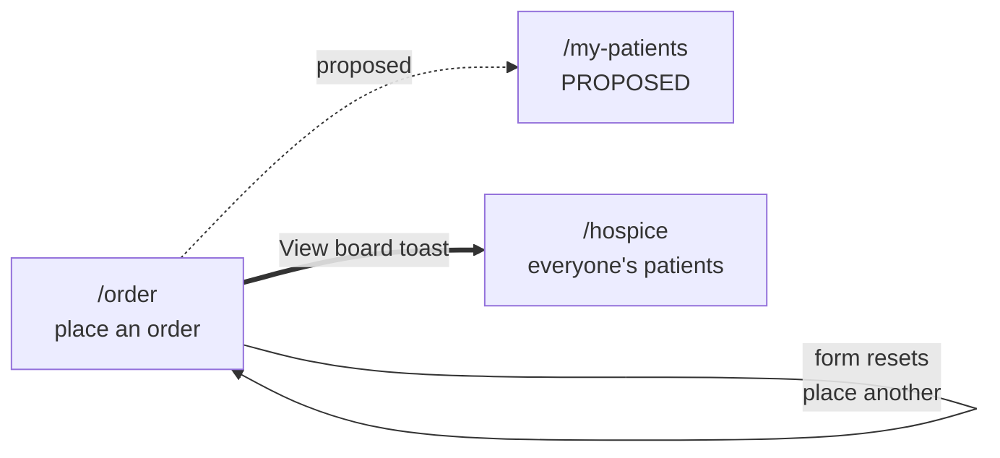
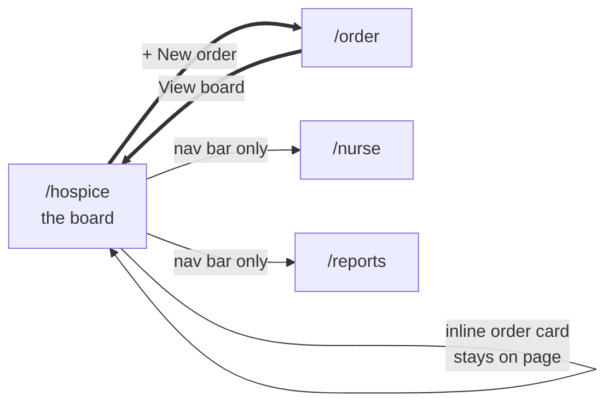
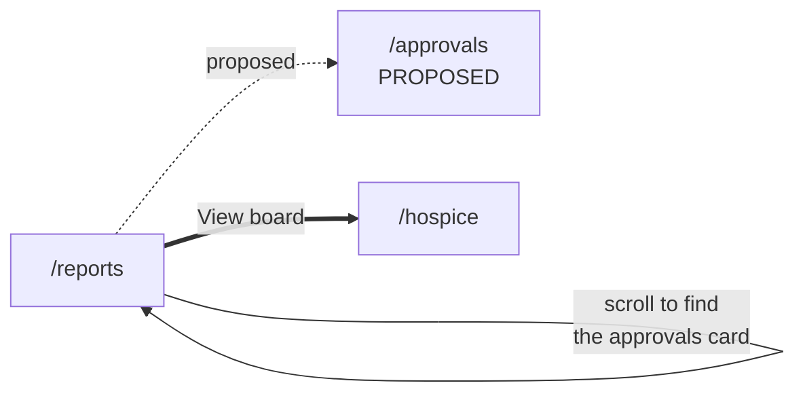
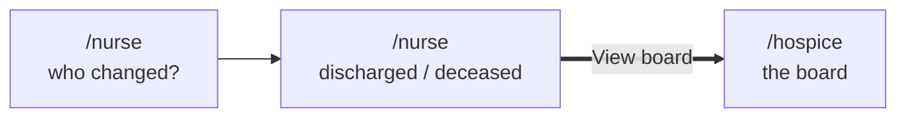
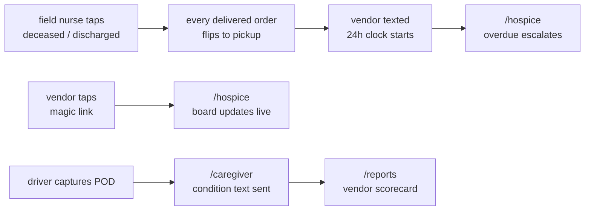

# Page map and navigation flow

**What this is:** every page in the app as a labelled box, with arrows showing where each user can
actually go from where.

**How this was verified — read this before trusting the arrows.** Every arrow below is a real
navigation affordance found in the code, not an inferred user journey. The search that produced it:

```bash
grep -rnE "useNavigate|navigate\(|window\.location|<Link|<NavLink|href=" client/src/pages/ client/src/components/
```

That returns **four** programmatic navigations in the entire application — all of them
`react-router` `navigate()` calls, no full page loads. Everything else is the global nav bar. An
earlier draft of this document drew vendor and driver arrows that were really *system events*, not
navigation — those now live in §4, clearly separated.

**Viewing:** mermaid renders on github.com natively; in VS Code use *Markdown Preview Mermaid
Support* + `Cmd+Shift+V`. All diagrams here were rendered through `mermaid-cli` v9 and v10 before
committing, not eyeballed.

Read with [FEATURES.md](FEATURES.md) and
[deliverables/DIFFERENTIATION.md](deliverables/DIFFERENTIATION.md).

---

## 1 · Every page, one line each

**11 routes, 10 page components** (`VendorPortal` serves both `/vendor-portal` and `/portal/:token`).

### Hospice staff — 4 pages

| Route | Persona in code | What the page is |
|---|---|---|
| `/order` | Admissions Nurse | Blank order form: patient, equipment, qty, needed-by, urgency, vendor |
| `/hospice` | Case Manager | The board. Orders by state, escalation bar, risk flags, AI review queue, vendor swap, inline order form, EMR simulator |
| `/nurse` | Field Nurse | Two taps: pick patient, then discharged/deceased. Fires the pickup trigger |
| `/reports` | Director of Nursing | Vendor scorecards, condition stats, calls avoided, pickup latency, DME spend, **and the cost-approval queue** |

### Vendor side — 5 pages

| Route | What the page is |
|---|---|
| `/portal/:token` | Magic link, no login. One order: Confirm, Set ETA, Can't fill it |
| `/vendor-portal` | Same component, no token — the demo entry |
| `/status/:token` | Read-only vendor status view |
| `/vendor` | Dispatcher board + in-page phone simulator |
| `/vendor-phone` | Full-screen SMS simulator, shows parse intent + confidence |

### Field & household — 2 pages

| Route | What the page is |
|---|---|
| `/driver` | Phone-sized. Today's stops, POD capture: photo, signature, condition checklist |
| `/caregiver` | Family's phone. Condition check arrives, reply 1-5 |

### Proposed — 2 more

| Route | What it would be | Why |
|---|---|---|
| `/approvals` | The DON's queue, sorted by how long each order has waited | Today it's a card buried on a weekly-reading page |
| `/my-patients` | Admissions nurse's "did my stuff arrive" list | She can place an order and then has nowhere to look |

---

## 2 · The navigation map

`App.tsx:103` splits the app in two. `/caregiver` and `/vendor-phone` render **outside** the Shell —
no nav bar, full-screen phone simulators. Everything else renders **inside** the Shell and gets the
same seven-link nav bar.



Thick arrows are the only two real in-app jumps. Thin arrows are the nav bar. Dashed arrows are
external entry — a texted link or a URL typed by the presenter.

**Where this stands after the XS fix batch:**

1. ~~`/nurse` and `/reports` have no exit at all.~~ **Fixed.** Both now carry a "View board" action
   in their header, so every hospice page has a designed way out and the board is the consistent
   home. The field nurse can finally see what her two taps set in motion.
2. ~~`/hospice` uses `window.location.href`, a full page reload that drops SSE.~~ **Fixed.** All
   four navigations are now `navigate()`. Nothing in the app tears down the event stream mid-demo.
3. **`/portal/:token` renders inside the Shell** — still true. A vendor who taps a no-login magic
   link is shown the hospice's internal nav. Role filtering (§5) softens this only if the vendor is
   signed in as a vendor role, which they never are: they arrive with no session at all, and signed
   out shows every link. **This is the one live UX bug left on this page.** See §8.1.

---

## 3 · Where each user can actually go

Roles now exist in the app — see §5 — so "can go" still means the same seven links for everyone.
These diagrams show where each role *needs* to go, with the gap called out.

### Admissions nurse



**One page, and its only real exit lands her on the wrong screen.** The "View board" toast sends her
to the case manager's board showing every patient in the hospice, not hers. `/my-patients` is the
missing box.

### Case manager



**The only well-connected role.** Both real navigations in the app belong to her, and the board has
its own inline order form so the common case never leaves the page. This is the one journey that was
actually designed.

### Director of nursing



**One page doing two jobs.** Approving orders is daily; reading scorecards is weekly. They share a
screen and the daily task is the one you scroll to find. She now has a way back to the board.

### Field nurse



**Two taps, and now a way to see what happened.** The screen fires the pickup trigger; the
consequences land on the board. Until the XS batch she had no route there, so the most important
thing she does in this app was also the thing she got no feedback on.

---

## 4 · System events — NOT navigation

These are the arrows I previously drew on the navigation map by mistake. Nobody clicks these; they
are events propagating through the backend and out over SSE. Keeping them separate is the point.



---

## 5 · Roles: identity shipped, authorization did not

**This changed under us mid-build.** Commit `16e242e feat(client): mock role-based login in the
shell` landed while this document was being written, so an earlier version of it — pushed as
`098edfa` — claimed there was no role state anywhere. That claim is now wrong.

**What exists** (`client/src/lib/auth.tsx`): a `ROLES` array of **six** roles — Case Manager,
Admissions Nurse, Field Nurse, Dispatcher, Driver, Director of Nursing — plus `AuthProvider`,
`useAuth()`, sign in, sign out, switch role, persisted to `localStorage`.

**What it does:** changes the avatar initials and the name in the top-right corner.

```bash
grep -rn "useAuth" client/src --include="*.tsx" --include="*.ts" | grep -v "lib/auth"
# client/src/App.tsx:47   <- the dropdown itself, and nothing else
```

**The nav now filters by role** (added in the XS batch). Each entry in `surfaceLinks` carries a
`roles: RoleId[]`, and `Shell()` filters against the signed-in role:

| Role | Sees in the nav |
|---|---|
| Case Manager | Board · New order · Nurse · Reports |
| Admissions Nurse | Board · New order |
| Field Nurse | Nurse |
| Director of Nursing | Board · Reports |
| Dispatcher | Vendor phone · Portal |
| Driver | Driver |
| *signed out* | *everything* |

**Routes are deliberately not guarded.** Filtering hides links; it does not block URLs. Every screen
stays reachable by typing the path, so a mis-click during the demo can't strand the presenter — and
switching role visibly rearranges the nav, which demonstrates the role model rather than describing
it.

**Signed out shows every link on purpose**, so nobody loses a screen before choosing a role. That
choice has one consequence worth knowing: a vendor arriving on a magic link has no session, so they
see the full hospice nav. Role filtering doesn't fix §2.3 — only moving the route out of the Shell
does.

**The deeper gap is unchanged:** `shared/types.ts:26` has
`Actor = 'hospice' | 'vendor' | 'driver' | 'system' | 'ai' | 'family'`. **`hospice` is one undivided
value.** Six roles now exist in the client and the ledger still cannot record which of them acted.
We tell judges the append-only ledger captures who acted and through which channel. For vendors
that's true; for hospice staff it isn't.

---

## 6 · The approval gate — what's real, what isn't

**Cost approvals already exist**, correcting another earlier error of mine: `mocks.ts` defines
`COST_APPROVAL_THRESHOLD_USD = 150` and `mockApprovals()`, and `Reports.tsx:437` renders
`CostApprovals` with working Approve/Deny buttons. My first grep covered only `server/` and
`shared/` for `*.ts` and missed the client `.tsx` entirely.

**But it is a mock, and the seam matters.** `decide()` (`Reports.tsx:450`) calls `setDecisions` —
local React state. No API call, no persistence, no ledger event, and **nothing gates dispatch**. An
order over $150/mo goes to the vendor whether or not the DON ever looks. The UI is real; the control
is not. **Don't demo the approve button as though it gates anything.**

Making it real means a `pending_approval` state ahead of `ordered`:

```
[pending_approval] -> ordered -> dispatched -> in_transit -> delivered -> pickup_pending
```

And that has a consequence worth a slide:

**An approval step is the first delay in this system that is the hospice's own fault.** Everything
we've built measures the vendor — silence ladder, on-time rate, unproven claims, condition. If a DON
sits on an approval for six hours, the bed is six hours late and **not one of our metrics would show
it.** Worse, if the SLA clock starts at *approval*, the vendor absorbs a delay they didn't cause and
the scorecards we ask a hospice to choose vendors with go quietly wrong.

So: **the clock starts at order placement**, approval latency is its own span attributed to the
hospice, and it shows on `/reports` beside the vendor scorecards. The DON's own screen shows the
DON's own drag. That's the honest version of "balance between care and cost" — a system that only
measures the vendor flatters whoever bought it.

**On the number:** `$150/mo` is real in the code but **not validated against any hospice**. Per
FAQ §6 we say that rather than let it read as researched.

---

## 7 · Build plan

| # | Item | Size | Status |
|---:|---|:--:|---|
| 1 | Filter `surfaceLinks` by `role` | XS | ✅ **done** — `roles: RoleId[]` per link, filtered in `Shell()` |
| 2 | Give `/nurse` and `/reports` an exit | XS | ✅ **done** — "View board" in both headers |
| 3 | Replace `window.location.href` with `navigate()` | XS | ✅ **done** — no full page reloads left |
| 4 | Move `/portal/:token` out of the Shell | **XS** | **next** — vendors on a magic link currently see the hospice nav. §2.3 |
| 5 | Split `Actor: 'hospice'` into the six roles in `auth.tsx` | **S** | The ledger still can't name our own people. Client already has the enum |
| 6 | Show cost + threshold warning on `/order` | **S** | CMS amounts are in `shared/catalog.ts`; the form never reads them |
| 7 | `/approvals` page — move `CostApprovals` off `/reports` | **S** | Component exists. Mostly a move plus queue sorting |
| 8 | Persist approvals: server state + `pending_approval` + dispatch gate | **M** | Turns the mock into the feature |
| 9 | Approval latency on `/reports` | **S** | The honesty beat in §6 |
| 10 | `/my-patients` | **M** | Needs a patient-to-staff assignment the seed doesn't have |

**The XS batch (1–3) is done.** Item 4 is the last XS one and the only live UX bug left. After that
the highest-value item is **5** — six roles now exist in the client and the ledger still records all
of them as an undivided `hospice`.

---

## 8 · Open questions

1. **Does the vendor magic link need its own chrome?** `/portal/:token` renders inside the hospice
   Shell today, showing an external vendor our full internal nav. Either move it outside the Shell
   like `/caregiver`, or accept it and don't dwell on it during the demo.
2. **Six roles in `auth.tsx` but three in the pitch.** Dispatcher, Driver and Field Nurse are in the
   switcher. Do we present six personas or three plus supporting cast?
3. **Can the case manager approve** under a lower second threshold? Currently modelled DON-only.
4. **Is $150/mo right?** Real in code, unvalidated against any hospice.
5. **Two order forms** — `/order` and the inline card on `/hospice`. They should share a component.
6. **`/vendor` vs `/vendor-phone`** — pre-existing naming collision, FEATURES.md §8.1. The demo
   driver needs to know which to open.
