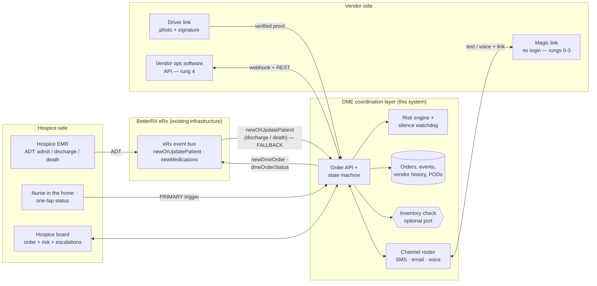

# Deliverable D — Integration Approach

*Assumptions this document relies on: see [ASSUMPTIONS.md](ASSUMPTIONS.md).*

*Draft. Everything below is a DESIGN — see "Built vs. sketched" for the line between what runs in the demo and what is drawn on paper. Event shapes are patterned on the real eRx payloads in `docs/BOUNTY-FAQ.md` §4.*

## The premise: DME rides the pipe medications already ride

FAQ §4 answers the only question that decides this architecture: *"BetterRX's eRx integration already receives these patient status events today. Teams can treat this as existing infrastructure. A DME workflow can reliably key off the same admission/discharge/death signals that already drive medication workflows."*

So we do not design a new EMR integration. We design **DME events as siblings of the medication events** already flowing through eRx — same envelope, same account/patient identifier blocks, same `product` shape with HCPCS where medications carry NDC. A DME order becomes one more thing eRx knows about a patient, which is also the answer to the "DME lives in a separate silo" pain point: same patient, same account, one ledger.

The FAQ is equally clear on the other half (§4): *"BetterRX does not currently receive or store delivery status data for DME… assume DME delivery status is a new capability to be built."* That's the reverse-direction event (`dmeOrderStatus`) — the new thing this system produces.

## Built vs. sketched

Honest labeling, because "integration-ready" is a claim judges should be able to check.

| Piece | Status |
|---|---|
| EMR patient-status intake — `POST /api/emr/patient-status` → `setPatientStatus(id, status, 'emr')` → auto pickup | **Built** (simulated EMR webhook; real payload mapping sketched) |
| Nurse-in-the-home trigger — `POST /api/patients/:id/status`, actor `hospice` | **Built** |
| Vendor channel — outbound message + magic link, no-login one-tap confirm/ETA/decline (`/api/portal/:token/...`) | **Built** |
| Driver POD capture → `delivery_verified` / `pickup_verified` on the order | **Built** (`server/store.ts` derives both from the `pods` table) |
| Free-text vendor reply → Claude parse → confidence gate → review queue (`POST /api/messages/inbound`) | **Built** |
| Order lifecycle, risk engine, silence ladder, escalations | **Built** |
| `newDmeOrder` / `dmeOrderStatus` event contracts below | **Sketched** — no eRx bus to connect to this weekend |
| eRx/EMR transport, auth, retry, and the HCHB partner-layer subscription | **Sketched** |
| Rung-4 vendor ops-software / API integration | **Sketched** — MatrixCare × Brightree is this exact pattern in production |
| Voice/IVR channel | **Sketched + spec'd** (`docs/IVR-SIM-SPEC.md`), deliberately shelved for the demo |
| Live inventory check at vendor selection | **Sketched as an optional port** — see §5; absent today by design |

## 1 · The whole flow



## 2 · `newDmeOrder` — the sibling of `newMedications`

Same `meta` / `account` / `patient.identifiers` envelope as the FAQ's `newMedications`, copied verbatim. `medications[]` becomes `dmeOrders[]`; inside each item the `externalId`, `product`, and `physician` blocks keep their exact shapes — only `product.codeType` changes from `NDC` to `HCPCS`, and `sig` (how to take it) becomes `instructions` (how to set it up). The two fields with no medication analogue are `urgency` and `targetWindow`, because a pill has no discharge deadline and a hospital bed does.

```json
{
  "meta": {
    "eventType": "newDmeOrder"
  },
  "account": {
    "identifiers": [
      { "id": "testAccountId" }
    ]
  },
  "patient": {
    "identifiers": [
      { "id": "testPatientId", "idType": "testPatientIdType" }
    ],
    "dmeOrders": [
      {
        "externalId": "9c1f4a02-6d38-4f5b-9a71-2f0c8e4b1d33",
        "product": {
          "codeType": "HCPCS",
          "code": "E0260",
          "name": "HOSPITAL BED SEMI-ELECTRIC WITH ANY TYPE SIDE RAILS, WITH MATTRESS"
        },
        "quantity": 1,
        "instructions": "SET UP IN FIRST-FLOOR LIVING ROOM. FAMILY REQUESTS BED RAILS UP. CALL HOSPICE ON ARRIVAL IF NO ONE ANSWERS.",
        "urgency": "urgent",
        "targetWindow": {
          "start": "2026-08-14T16:00:00Z",
          "end": "2026-08-15T15:00:00Z",
          "basis": "dischargeHome"
        },
        "physician": {
          "identifier": { "id": "1497771109", "idType": "npi" }
        }
      }
    ]
  }
}
```

**Field mapping, medication → DME:**

| `newMedications` | `newDmeOrder` | Note |
|---|---|---|
| `meta.eventType` | `meta.eventType` | Identical envelope |
| `account.identifiers[]` | `account.identifiers[]` | Verbatim |
| `patient.identifiers[]` | `patient.identifiers[]` | Verbatim — same join key, so DME spend and med spend land on one patient |
| `medications[]` | `dmeOrders[]` | Array of line items either way |
| `externalId` | `externalId` | Vendor-neutral order key; echoed on every status event |
| `product.codeType: "NDC"` | `product.codeType: "HCPCS"` | HCPCS Level II E-codes are the CMS coding set built for DME |
| `sig` | `instructions` | Free-text human directions; same role, different verb |
| `physician.identifier.idType: "npi"` | unchanged | Same ordering-provider block |
| — | `quantity`, `urgency`, `targetWindow` | New: DME has a delivery deadline, a drug does not |

`urgency` ∈ `routine | urgent | stat` matches `Urgency` in `shared/types.ts`. `targetWindow.basis` names *why* the deadline exists (`dischargeHome`, `admission`, `routineReplenish`) so the SLA assumption from FAQ §7 — same-day for urgent/STAT, 24h for routine — is applied by the receiver rather than hard-coded by the sender.

## 3 · `dmeOrderStatus` — the reverse direction (the new capability)

The event eRx does not receive today. Same envelope again; `externalId` ties it back to the `newDmeOrder`. This is where the vendor-reported vs. verified distinction rides the wire.

```json
{
  "meta": {
    "eventType": "dmeOrderStatus"
  },
  "account": {
    "identifiers": [
      { "id": "testAccountId" }
    ]
  },
  "patient": {
    "identifiers": [
      { "id": "testPatientId", "idType": "testPatientIdType" }
    ],
    "dmeOrders": [
      {
        "externalId": "9c1f4a02-6d38-4f5b-9a71-2f0c8e4b1d33",
        "product": {
          "codeType": "HCPCS",
          "code": "E0260",
          "name": "HOSPITAL BED SEMI-ELECTRIC WITH ANY TYPE SIDE RAILS, WITH MATTRESS"
        },
        "status": "delivered",
        "statusAt": "2026-08-15T13:52:00Z",
        "eta": "2026-08-15T14:00:00Z",
        "vendor": {
          "identifier": { "id": "wasatch-medical", "idType": "dmeVendorId" },
          "name": "Wasatch Medical Supply"
        },
        "evidence": {
          "capturedVia": "driverLink",
          "deliveryVerified": true,
          "pickupVerified": false,
          "proof": [
            { "kind": "photo", "ref": "pod:1042-delivery-photo" },
            { "kind": "signature", "ref": "pod:1042-delivery-signature" }
          ]
        },
        "risk": {
          "score": 12,
          "reasons": ["delivered 8 minutes ahead of the committed ETA"]
        }
      }
    ]
  }
}
```

**Status vocabulary** — the wire values are the plain-language set, mapped from `OrderState` in `shared/types.ts`:

| Wire `status` | `OrderState` | Fires on |
|---|---|---|
| `accepted` | `dispatched` | Vendor taps confirm (or texts yes) |
| `enRoute` | `in_transit` | Vendor/driver says it's on the truck |
| `delivered` | `delivered` | Driver POD, or a vendor claim pending POD |
| `pickupPending` | `pickup_pending` | Death/discharge triggered the pickup |
| `pickupOverdue` | `pickup_overdue` | Watchdog past `PICKUP_WINDOW_HOURS` |
| `pickedUp` | `picked_up` | Pickup POD captured |
| `declined` / `cancelled` | `cancelled` | Vendor can't fill it; order needs a new vendor |

`eta` is the vendor's forward-looking commitment and is present from `accepted` onward — it is the field that lets a deadline miss be predicted rather than reported.

**`evidence` is the honesty block.** `deliveryVerified` / `pickupVerified` are the wire spelling of `Order.delivery_verified` and `Order.pickup_verified` in `shared/types.ts` — booleans derived in `server/store.ts` from whether a POD row exists for that order and kind, never from anything a vendor asserted. `capturedVia` ∈ `driverLink | vendorTap | vendorText | vendorKeypress | vendorApi | emrInferred` records how the claim arrived. A consumer of this event can therefore always tell a claim from a proof, which is the same distinction the hospice board badges on screen. A vendor texting "delivered" produces `status: "delivered"`, `capturedVia: "vendorText"`, `deliveryVerified: false` — a legitimate status, clearly labeled unproven.

## 4 · Patient status: two paths, and the sponsor's own failure case decides the order

FAQ §8 is unambiguous, and it is their discovery data, not our guess: *"A direct trigger from the nurse in the field at the time of death or discharge is the preferred design, rather than relying solely on EMR status propagation. We've seen the EMR-only path fail in practice: our own discovery interviews surfaced a case where a patient's death didn't reach the DME vendor's system in time for pickup. Both paths should be supported: nurse-initiated as the primary, faster signal, with EMR-based status as a redundant fallback."*

So we built both, into one function, with the source recorded on the event.

**PRIMARY — nurse in the home (built).** One tap on a phone at the bedside: `POST /api/patients/:id/status` → `setPatientStatus(id, status, 'nurse')`, actor `hospice`. Every delivered order for that patient transitions to `pickup_pending`, the vendor gets a pickup request with a magic link, the job appears on the driver view, and the pickup watchdog clock starts. The signal is generated by the human who is physically standing in the room where the truth just happened — there is no faster source, and no propagation to wait on.

**FALLBACK — ADT via eRx (built as a simulator; payload mapping sketched).** The `newOrUpdatePatient` event that eRx already receives carries the demographic record; discharge and death arrive on that same channel. Our subscriber maps it and calls the identical code path:

```
newOrUpdatePatient
  → patient.identifiers[0].id ................ → patient lookup (eRx patient id is the join key)
  → patient status (deceased / discharged) ... → PatientStatus
  → event receipt time ....................... → effective_at
      ↓
POST /api/emr/patient-status  { patient_id, status }
      ↓
setPatientStatus(id, status, 'emr')   // server/pickups.ts — actor 'system'
      ↓
same pickup trigger, same vendor message, same watchdog
```

Both routes converge on `setPatientStatus()` in `server/pickups.ts`; the resulting `pickup_triggered` event carries `payload.source: 'nurse' | 'emr'`, so the ledger always shows which path fired first. Whichever arrives second is a no-op: `setPatientStatus()` only triggers pickups for orders still in `delivered`, so the second signal finds nothing to trigger and the vendor is never texted twice.

That redundancy is the entire point. The failure in their interview was a single path with no backup. Ours is two independent paths where the fast one is a human tap and the slow one is infrastructure that already exists.

**Direction out:** order status writebacks to the patient chart (`dmeOrderStatus` above, or the EMR partner layer for EMRs we integrate directly) so the chart shows equipment delivered/picked up with a POD reference. Nice-to-have, not load-bearing.

**A note on the EMRs themselves — this is a precedent, not a hypothesis.** The pattern this design rests on already runs in production, and each of the bounty's reference EMRs corroborates a different piece:

- **Axxess × BetterRX (documented today).** Axxess's own integration docs describe patient demographics, admission/discharge status, diagnoses, allergies *and* medications syncing into BetterRX — event-triggered, one-directional EMR → BetterRX. That is the exact envelope §2 builds on, already flowing. DME becomes one more event on a pipe that provably exists.
- **HCHB Business Connect (the partner-layer precedent).** A purpose-built partner-connection layer that automates DME/supply ordering and shares real-time patient status with outside vendors (e.g. its Qualis DME partnership) — the model we design *against*.
- **MatrixCare × Brightree (the rung-4 ceiling).** A bi-directional DME ordering interface built into the hospice EHR — no bolt-on portal — with the leading DME-vendor platform. Proof that native, deep integration is a real destination (§5), not the entry price.

We design against these but do not depend on them: eRx already receives the patient/medication events, so the DME workflow keys off a feed BetterRX controls rather than one it has to negotiate per hospice.

**The one honest gap — the identity join.** Everything operational already fits the schema; the field it can't hold *yet* is the external `patient.identifiers[].id` (and `account.identifiers[].id`) from the eRx envelope. Today `patients.id` is a local integer, so in the demo a DME order attaches to a patient we created, not to *the* eRx patient. Wiring to the real bus adds that external key as the join — the step that makes "DME and medications on one patient ledger" literally true rather than architecturally intended. A seam to connect, not a schema to rebuild: the `Order` / `Patient` shapes in `shared/types.ts` are unchanged, gaining an external-id column.

## 5 · Vendor side: integration is the ceiling, never the floor

The asymmetry that shapes everything: hospices can integrate; the long tail of regional DME vendors is a warehouse, trucks, and a dispatcher. Any architecture whose entry requirement is a vendor API, webhook, or portal login excludes exactly the vendors causing the pain — and is worth zero on day one, when BetterRX has no vendor network at all (FAQ §2).

### Rungs 0–3 — zero vendor integration (built)

This is FAQ §3's prescribed baseline taken literally: *"design for a vendor who may never log into anything and only ever responds via a confirmation email or text (SMS/magic-link style)."*

| Rung | Vendor does | Integration required | We get |
|---|---|---|---|
| 0 | Nothing — the hospice enters a phone number from its own rolodex | **None** | Reachability, with no BetterRX vendor network needed |
| 1 | Replies to a text, or taps the link in it | **None** | Accept / decline / ETA — forward-looking commitments |
| 2 | Driver taps the link, snaps a photo + signature | **None** | Verified proof at delivery and pickup |
| 3 | Taps the same kind of link into a standing dispatch board | **None** | Deeper voluntary engagement, still no account |

Every outbound touch (order request, nag, pickup request) is a message carrying a magic link. The link opens a no-login page scoped to that vendor's orders: Confirm, Set ETA, Can't fill it — one tap each, deterministic, confidence 1.0, no model in the path. Onboarding a vendor is typing their phone number. Silence is also an input: an untapped link near a deadline is a risk signal, a nag, then an escalation — non-response was ambiguous in the phone world; here it is data.

Free-text replies still work for vendors who'd rather type a sentence — `POST /api/messages/inbound` parses them with Claude, and anything under the 0.8 confidence gate lands in a human review queue instead of moving the order.

### Rung 4 — vendor ops software / API (sketched)

For the minority of vendors with real systems — and per the brief, bigger vendors' ops software often already has GPS and POD internally, it's just "rarely surfaced back to the hospice in a usable way." The gap there is surfacing, not data creation. Two symmetric halves, no new vocabulary:

- **Inbound:** the vendor's system POSTs the same `dmeOrderStatus` body to a per-vendor endpoint (HMAC-signed, `externalId` as the idempotency key). It lands in the same `applyEvent()` path as a magic-link tap, with `capturedVia: "vendorApi"`.
- **Outbound:** we POST `newDmeOrder` to their order-intake webhook instead of texting a link. Same payload the eRx bus carries.

Rung 4 is strictly better data at strictly higher onboarding cost. It is an upgrade path for vendors already in the loop, never the price of admission. This isn't hypothetical: MatrixCare's hospice EHR ships a bi-directional ordering interface with Brightree built into the chart — rung 4 already exists in the market, which is why we design toward it without requiring it.

### The shelved rung — voice/IVR for landline-only vendors (sketched, spec'd, cut from the demo)

Half a hospice's vendor rolodex is office landlines, and a landline cannot receive SMS. The channel router forks on carrier lookup (Twilio Lookup classifies each number as mobile or landline): textable numbers get the link, the rest get an automated 30-second check-in call — *"press 1 to confirm, press 2 to give an ETA"* — where a DTMF keypress is deterministic, confidence 1.0, and needs no model at all. Both forks land in the same pipeline, the same `applyEvent()`, the same ledger.

The full production path is written up in `docs/IVR-SIM-SPEC.md` §10: Twilio Programmable Voice for placing calls, `<Gather input="dtmf">` posting to the same keypress endpoint shape, status callbacks (`no-answer`, `busy`, `machine_start`) replacing our silence timer with something strictly richer, plus webhook signature validation and B2B automated-call consent as named production gaps. **We deliberately cut it from the build** — the magic link covers the demo's structured-input path, and voice would have bought a second channel instead of a deeper story. It stays in the deliverable because "rung 1 is channel-agnostic" is only true if the voice fork is designed, not hand-waved.

## 6 · Forward-compatibility: where a live inventory check slots in

FAQ §9: *"Is there anticipated to be a live inventory API for the vendor system to verify inventory prior to the hospice operator selecting that org for the order?"* — *"Unlikely to be available in practice… That said, we'd encourage teams to design for the option. Architecting the ordering flow so a real-time inventory check could be added later with a graceful fallback to a price/service-based experience when live inventory isn't available. **This kind of forward-compatible design is exactly the kind of thinking we value most in judging.**"*

Taken at face value, that is a design instruction: build the seam now, leave it empty.

**The seam is one optional port at exactly one point in the flow** — vendor ranking, which happens between "nurse fills out the order" and "we message a vendor":

```
placeOrder(hcpcs, quantity, urgency, targetWindow, serviceArea)
  │
  ├─ candidates = vendors serving serviceArea for this HCPCS code
  │
  ├─ availability = inventoryProvider?.check(candidates, hcpcs, quantity, targetWindow)
  │        │                              ▲
  │        │                              └── the port: absent today, returns null
  │        │
  │        ├─ present → rank by: in-stock first, then on-time history, then price
  │        │            order carries { availability: "confirmed", checkedAt, source }
  │        │
  │        └─ absent  → rank by: on-time history for this HCPCS × weekday, then price
  │                     order carries { availability: "unknown" }
  │
  └─ send newDmeOrder / magic link to the top-ranked vendor
```

Three properties make this a real seam rather than a promise:

1. **The fallback is the built path, not a degraded one.** Today's ranking is price/service-based — vendor on-time rate for that equipment on that weekday, from `vendor_stats`, plus cost. That is a complete, shippable selection experience. Adding inventory *narrows* the candidate set before ranking; it does not change how ranking works, so the code that exists is the code that survives.
2. **Availability is a labeled field, never an assumption.** The order record carries `availability: "confirmed" | "unknown"` with `checkedAt` and `source`. The board says "availability unknown — ranked on on-time record and price" rather than implying a check that never happened. Same discipline as `deliveryVerified`: the system never presents an unverified thing as verified.
3. **Absence of stock data is already handled downstream.** A vendor who can't fill the order declines by tapping "Can't fill it," which frees the order for a one-click swap. A live inventory check makes that decline rarer; it was never the only defense against it. Nothing in the flow assumes the check exists.

The natural first implementation, when a vendor network exists: rung-4 vendors expose a stock endpoint and answer `confirmed`; rung 0–3 vendors answer `unknown` forever and get ranked exactly as they are today. Mixed-fidelity by construction — which is the only kind of vendor network this product will ever have.

## 7 · Why this is credible without a live connection

Every seam above already exists in the prototype behind a simulator: the EMR feed is `POST /api/emr/patient-status`, the nurse trigger is `POST /api/patients/:id/status`, the vendor channel is the magic-link portal plus `POST /api/messages/inbound`, the proof capture is `POST /api/orders/:id/pod`, and the order shape is the actual `Order` interface in `shared/types.ts` — `delivery_verified` and `pickup_verified` included. Swapping the simulators for the eRx bus, an EMR partner layer, and Twilio changes transport, not architecture.

On the billing side, delivery-completion events give the vendor's existing X12 837 claims process a documented trigger with POD attached — aimed at the DME claim denial rate that is largely documentation gaps. We don't process claims; we hand the vendor's biller better evidence, which is also why a vendor with no reason to care about hospice visibility has one anyway.
