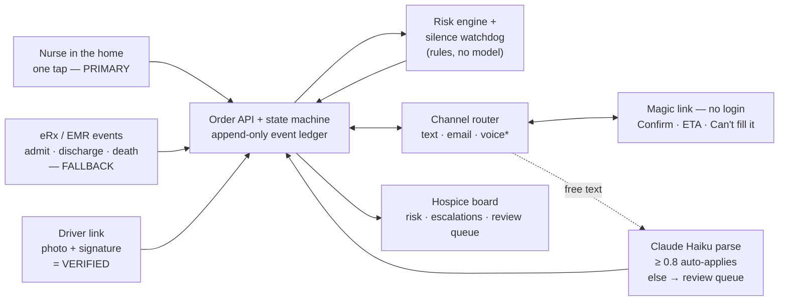

# Deliverable F — Pitch Slide Skeleton

*Assumptions this document relies on: see [ASSUMPTIONS.md](ASSUMPTIONS.md).*

**5:00 pitch + Q&A · 3 BetterRX judges · the demo is the centerpiece.** Five slides. They frame the
demo; they never compete with it. Slide 3 is the demo — it exists only so the deck doesn't go dark
while the laptop is driving.

**Arc (north star, `docs/PROBLEM-THESIS.md`):** heart open → mechanism middle → heart close. An
emotional *middle* reads as manipulation; an emotional *frame* reads as purpose.

## Build rules for whoever makes these slides

- **Bullets are prompts, not paragraphs.** 3–5 fragments a slide, ≤ 7 words each. The presenter's
  lines below are what gets *said*; they do not go on the slide.
- **Nothing on a slide that isn't in the repo**, or that isn't clearly labeled *production path*.
  Use the same words the deliverables use — "built," "spec'd not built," "synthetic."
- **`[FE PENDING]` awareness** ([DEMO-SCRIPT.md](DEMO-SCRIPT.md)): never show a screenshot of a screen
  the demo can't open. If the `/reports` view doesn't ship, the "phone calls that never happened"
  number goes on slide 5 **labeled as computed from the event log** — do not mock a screen.
- **Do not hardcode vendor percentages on a slide.** Vendor stats are *derived* from `scripts/seed.ts`
  (base rate × weak-day/weak-code penalties), so the numbers change with the seed and the weekday
  (see `CLAUDE.md` → Gotchas). Say "on-time history for this equipment on this weekday"; let the
  live board supply the digits.
- Every timing/cost number must match [AI-APPROACH.md](AI-APPROACH.md) exactly. Nothing rounded up.
- Slides carry a **SYNTHETIC DATA** footer wherever a performance number appears.

---

## Slide 1 — "Margaret is coming home Friday to die at home"

*Heart open. Mirrors [DEMO-SCRIPT.md](DEMO-SCRIPT.md) §1 cold open — the presenter says these words
with the laptop closed. If the deck and the script diverge, the script wins.*

**On the slide**
- Margaret Osei, 71 — home Friday to die at home
- The bed has to be there Thursday night
- The hospice doesn't own the bed, the truck, or the driver
- Two moments they're accountable for and cannot watch
- *"Taking care of these patients"* — BetterRX discovery

**Presenter says**

> "Margaret Osei is 71. On Friday morning she is coming home from the hospital to die at home,
> because that is what she asked for and what her hospice promised her family. That promise only
> works if a hospital bed is in her living room the night before. The hospice does not own that bed,
> does not employ the driver, and cannot see the truck. They will get the phone call from her
> daughter either way."
>
> "There are two moments a hospice is accountable for and cannot watch: equipment in place before a
> discharge home, and equipment out of the house after a death. Your own discovery has someone dying
> without the vendor ever finding out. You called this **taking care of these patients** — that's
> the register we built in."
>
> **The frame:** "Every solution to this problem dies on the same question — *what does the vendor
> have to do?* Our answer: **tap a link.**"

**Steal from**
- [PROBLEM-THESIS.md](../PROBLEM-THESIS.md) → *North star* (the two failure moments, "nobody in a
  grieving house should have to chase a truck"), *Positioning and Q&A* → the one-line frame.
- [DEMO-SCRIPT.md](DEMO-SCRIPT.md) §1–§2 — verbatim.

> **Wording check.** The thesis writes the frame as *"reply to a text"*; that predates the
> magic-link decision. Use **"tap a link"** — it matches DEMO-SCRIPT beat 2 and what the demo
> actually shows. Keep both slide and script on the same half of the sentence.
>
> **Date check.** "Friday / Thursday night" only lines up on a Thursday demo (seed deadlines are
> `now + 16h`). Always-true fallback wording: *"home tomorrow morning — the bed has to be there
> tonight."*

---

## Slide 2 — The insight: only one side of this can integrate

*Mechanism begins. This is the honesty slide — we name the floor the FAQ gave everyone, then show
what we put above it.*

**On the slide**
- Hospices integrate. Warehouse-and-trucks vendors don't
- **Integration is the ceiling, never the floor**
- Ladder: phone number → tap → driver proof → board → API
- FAQ §3 gave every team the SMS/magic-link floor — we don't claim it
- Above it: **silence ladder · verified vs reported · nurse-primary pickup**
- Half a rolodex is landlines → rung 1 is channel-agnostic

**Presenter says**

> "The asymmetry that shapes everything: hospices run real EMRs, so hospice-side integration is
> credible engineering. The long tail of DME vendors is a warehouse, some trucks, and a dispatcher —
> no IT, no API, no webhook. Any architecture whose entry requirement is vendor-side integration
> excludes exactly the vendors causing the pain, and is worth zero on day one when there's no vendor
> network at all. So integration is our ceiling, never our floor. Rung zero is: the hospice types a
> phone number in from its own rolodex."
>
> "Your FAQ told every team in this room to design for a vendor who never logs into anything — text
> or magic link. So that's table stakes as of that document, and we're not going to stand here and
> sell it to you as our idea. We built it. Here's what we built **above** it: **silence is a
> reading** — an untapped link near a deadline nags the vendor and then escalates to a human, and
> the case manager never polls. **Verified versus vendor-reported** — every status is badged by its
> evidence, and a 'delivered' with no photo and no signature opens its own escalation. And the
> **pickup trigger sits in the nurse's hand** in the living room, with the EMR as the backup, which
> is the ordering your §8 asked for."
>
> **The landline beat:** "And half a hospice's rolodex is office landlines — a landline cannot
> receive a text. That's why the ladder's first rung is channel-agnostic by design: carrier lookup
> routes each number to text or to a 30-second check-in call where pressing 1 is deterministic, no
> model at all. That fork is spec'd, not built this weekend — production path, and I'll say so."

**Steal from**
- [DIFFERENTIATION.md](DIFFERENTIATION.md) → *The baseline every team will show*, the *Above the line*
  table (lift the three left-hand rows as-is), §1 silence ladder, §2 verified vs reported, §3 pickup.
- [PROBLEM-THESIS.md](../PROBLEM-THESIS.md) → *The core asymmetry*, *The vendor adoption ladder*, and
  the landline Q&A bullet.
- [INTEGRATION-SKETCH.md](INTEGRATION-SKETCH.md) §5 → the shelved voice rung (say "spec'd, cut on
  purpose" — never imply it runs).

---

## Slide 3 — DEMO

*Placeholder slide. It anchors the live demo and gives the room something calm to look at if a tab
is loading. No content competes with the screen. Consider: the word **DEMO**, the three scenario
names, nothing else.*

**On the slide**
- **Scenario 1** — the case worker's save (1:00)
- **Scenario 2** — the nurse in the home (0:45)
- **Scenario 3** — the cold-start vendor (1:30)

**Beat list + timing budget (from [DEMO-SCRIPT.md](DEMO-SCRIPT.md) — presenter's copy, not the slide)**

| # | Beat | Length | Running |
|---|---|---|---|
| 1 | Cold open — Margaret (**slide 1**, no screen) | 0:25 | 0:25 |
| 2 | The problem + the one-line frame (**slide 1–2**) | 0:20 | 0:45 |
| 3 | **Scenario 1** — risk fires → one-click vendor swap → magic-link confirm → POD | 1:00 | 1:45 |
| 4 | **Scenario 2** — nurse taps "died" → both pickups auto-scheduled → POD → family notified | 0:45 | 2:30 |
| 5 | **Scenario 3** — brand-new vendor taps the link (5a) → the vendor who never taps: nag → escalation (5b) | 1:30 | 4:00 |
| 6 | Reporting beat — the directing nurse | 0:15 | 4:15 |
| 7 | Close — the family line (**slide 5**) | 0:15 | 4:30 |
| — | **Slack** — seed reloads, a late watchdog tick, one judge interruption | **0:30** | 5:00 |

**Cut order if behind at 3:00:** drop the scenario-1 delivery, then the reporting beat.
**Never cut scenario 3's silence variant (5b)** — it is the differentiator. The close is never cut.

**Steal from**
- [DEMO-SCRIPT.md](DEMO-SCRIPT.md) → *Timing budget*, §3–§5 click tables, *Failure drills*.

> **`[FE PENDING]` honesty.** As of this writing the demo's highest-value missing screen is the
> **`/portal/:token` page** (backend done, no route in `App.tsx`) — it gates scenario 1 step 4 and
> scenario 3's climax. Also pending: the nurse status screen, the ✓ Verified badge, plain-language
> state labels, and the `/reports` view. **Re-check the FE punch list at freeze and delete any slide
> promise that didn't ship.** If `/reports` doesn't land, beat 6 is cut and its number moves to
> slide 5 as a computed figure.

---

## Slide 4 — What's underneath, and where the AI is (and isn't)

*One-slide architecture + the AI honesty block. Simplified from
[INTEGRATION-SKETCH.md](INTEGRATION-SKETCH.md) §1 — five boxes, not fifteen.*

**On the slide**
- Two paths in: **nurse tap (primary) · eRx events (fallback)**
- One state machine, one append-only ledger
- DME rides the pipe medications already ride
- **Haiku only where rules can't go**; a tap needs no model
- **0.8 confidence gate → human review queue**
- **~$0.003–0.006 per order, measured**
- Hospice pays PPD, bundled with pharmacy PPD (your §5)
- All timing data **SYNTHETIC**, labeled

*\* voice fork = production path, spec'd not built (`docs/IVR-SIM-SPEC.md`).*

**Presenter says**

> "Underneath: every status change in the system goes through one state machine and lands in an
> append-only ledger that records who said it and through which channel. Patient status comes in two
> ways — the nurse's tap, primary, and your eRx feed as the redundant fallback — and both call the
> same function, so the ledger always shows which one fired first. On the write side, a DME order is
> a sibling of `newMedications`: same envelope, same identifiers, HCPCS where meds carry NDC. We
> aren't asking you to build a new EMR integration; we're asking DME to ride the pipe you already
> have."
>
> "On AI: we used a model in exactly one place — reading a vendor's free-text reply and resolving
> *which order* it's about and *when* 'Thursday morning' is. Regex structurally cannot do those two
> things. Everything else is deliberately not AI: risk scoring is a rules engine, because that's a
> lookup table with a threshold and every score has to be a sentence a case manager can argue with.
> The magic-link tap is deterministic — confidence 1.0, no model in the path of a state change. And
> the parse only auto-applies at **confidence ≥ 0.8 with a resolved order**; everything else lands
> in a review queue where a person decides. With no API key at all, the pipeline degrades *to the
> queue* rather than guessing."
>
> "It runs on Haiku 4.5 because it's extraction, not reasoning: about 620 input and 50 output tokens
> per message, roughly **a tenth of a cent per message and $0.003 to $0.006 per order end to end**,
> measured off our own test harness, not estimated. At a thousand orders a month that's about five
> dollars of inference."
>
> "Two honesty notes. The economics aren't ours to invent — **your §5 says the hospice pays PPD,
> bundled with the pharmacy tech PPD you already charge**, so we quote you rather than model it.
> And every delivery-timing number in this demo is **synthetic and labeled synthetic**. CMS DMEPOS
> grounds utilization and cost; it's billing data, not logistics, so we draw no timeliness
> conclusions from it. Your §6 asked for approach and honesty over manufactured precision — this is
> us taking that literally."

**Steal from**
- [INTEGRATION-SKETCH.md](INTEGRATION-SKETCH.md) → §1 diagram (simplify as above), §2 the
  `newDmeOrder` field mapping, §4 the two patient-status paths, and the **Built vs. sketched** table
  (keep it in the back pocket for Q&A — it's the "claims judges can check" table).
- [AI-APPROACH.md](AI-APPROACH.md) → *Where we deliberately did NOT use it*, *Safety design*,
  *Model choice*, *Cost per order (measured)*.
- [ASSUMPTIONS.md](ASSUMPTIONS.md) → *Data* (SYNTHETIC), *Economics — a GIVEN, not an assumption*.
- [BOUNTY-FAQ.md](../BOUNTY-FAQ.md) §5, §6.

> **Number discipline.** `$0.003–0.006/order`, `~620 in / ~50 out tokens`, `~$0.001/message`,
> `~$5/month at 1,000 orders`, `1–2s latency`, `6/6 on the test set`, `confidence ≥ 0.8`. If a
> number isn't on that list, it isn't on the slide.

---

## Slide 5 — Phone calls that never happened

*Heart close. Step away from the laptop.*

**On the slide**
- The measure: **phone calls that never happened**
- Margaret's bed was in the house before she was
- Ruth's family made zero phone calls
- **The family never knows the system exists**
- Vendor's total cost of entry: one tap
- Post-hackathon: a foundation, not a demo

**Presenter says**

> "Every mechanism you just watched maps to one phone call a human never had to make. Margaret's bed
> was in the house before she was. Ruth's family woke up on the worst week of their lives and the
> hospital bed was already gone — and nobody in that house ever knew any of this existed. The saved
> discharge looks, to the daughter, like nothing happening. That's the point. **The measure we built
> for is phone calls that never happened.** And the vendor's entire cost of entry was tapping one
> link."
>
> **Post-hackathon (only if there's air):** "Your §10 said you'd look at this as a foundation for a
> real DME product. So we built it to be picked up: the state machine, risk engine, and the parse
> gate are test-covered, every assumption we made is written down in a register with what breaks if
> it's wrong, and the integration is drawn against your actual eRx payloads. The seams that are
> simulators today — the EMR feed, the channel, the inventory check — swap transport, not
> architecture."

**Steal from**
- [PROBLEM-THESIS.md](../PROBLEM-THESIS.md) → *North star* ("the measure of this system is phone
  calls that never happened").
- [DEMO-SCRIPT.md](DEMO-SCRIPT.md) §7 close — verbatim.
- [DIFFERENTIATION.md](DIFFERENTIATION.md) → *The measure: phone calls that never happened* table
  (a strong optional slide-5 visual if there's room), and the closing line.
- [BOUNTY-FAQ.md](../BOUNTY-FAQ.md) §10.

> If the `/reports` counter shipped, the number goes here live. If it didn't, put the figure on this
> slide **labeled "computed from the append-only event log"** and say that out loud. Do not imply a
> screen that doesn't exist.

---

## Rubric evidence map

Five judging rows. One line each naming where in the pitch that row gets its evidence — if a row
has no home, the deck is broken, not the row.

| Row | Weight | Where it gets its evidence |
|---|---|---|
| **Differentiation** | 30% | **Slide 2** names the FAQ §3 floor out loud and refuses to claim it, then puts three things above it — silence ladder, verified-vs-reported, nurse-primary pickup — and **demo beat 5b** *shows* the silence ladder nag and escalate live, which is the one beat that is never cut. |
| **Core user problems** | 25% | **Slide 1** is the problem in the patient's own frame (the two unwatchable moments, quoted back in the sponsor's discovery language), and **demo beats 3–4** resolve both of them as outcomes — the saved discharge and the dignified pickup — across all three named hospice personas. |
| **Architecture / integration** | 15% | **Slide 4's** diagram plus the `newDmeOrder`-as-sibling-of-`newMedications` mapping against BetterRX's real eRx payloads; the **Built vs. sketched** table ([INTEGRATION-SKETCH.md](INTEGRATION-SKETCH.md)) is the Q&A backup that lets a judge check every claim. |
| **AI ROI** | 15% | **Slide 4's** AI block: one deliberate use (open-vocabulary parse where rules structurally cannot work), rules everywhere else, deterministic taps with no model, the 0.8 gate into a human review queue, and **measured** cost of ~$0.003–0.006/order — approach and honesty, per FAQ §6, not claimed accuracy. |
| **UX** | 15% | **The demo itself (slide 3)** carries this row: one obvious action per screen, plain words instead of state-machine terms, the nurse's one-tap pickup and the vendor's no-login one-tap confirm — say the sponsor's own bar back to the room while the board is up: *"think of your mom's least technical friend."* |

**Rubric audit ritual** (`docs/BUILD-DAY-TASKS.md`): run this table twice — mid-day and pre-freeze.
Any row whose evidence is a `[FE PENDING]` screen at freeze must be re-pointed at something that
actually runs, or spoken instead of shown.

---

## Show-off inbox

**Built something demo-worthy? Drop a one-liner here.** Anyone on the team, any time, no formatting
rules — what it is, and where to see it. This list gets harvested into the slides and the demo
script before code freeze. **If it isn't in this inbox, it won't be on stage.**

<!-- Format that helps: "<what it is> — <where to click it / file> — <which slide it might strengthen>" -->

- 
- 
- 
- 
- 

*(Harvested → moved into a slide above → delete the line. An empty inbox at freeze means either
nobody built anything new or nobody wrote it down; assume the second.)*
